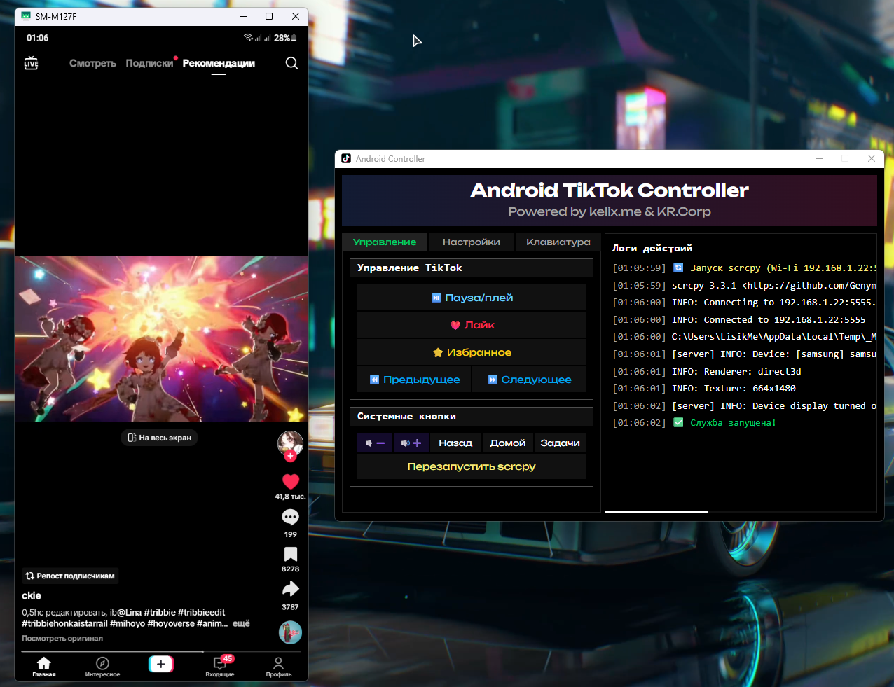

# Android TikTok Controller

Утилита для управления TikTok на Android устройстве через компьютер с помощью ADB и scrcpy.



## Возможности

- Управление TikTok с компьютера:
  - Пауза/плей видео
  - Постановка лайков
  - Добавление в избранное
  - Прокрутка ленты (вверх/вниз)
- Системные функции:
  - Управление громкостью (увеличение/уменьшение)
  - Кнопки "Назад", "Домой", "Недавние приложения"
- Гибкие настройки:
  - Настройка координат кнопок (Калибровка под экран)
  - Настройка горячих клавиш
  - Подключение по USB или Wi-Fi
- Запуск scrcpy в нем происходит всё взаимодействия
- Логирование всех действий
- Русскоязычный интерфейс

## Преимущества

1. **Простота использования** - интуитивно понятный интерфейс
2. **Гибкость настроек** - возможность кастомизации под разные устройства
3. **Два режима подключения** - работа по USB и Wi-Fi
4. **Горячие клавиши** - быстрое управление без переключения окон
5. **Логирование** - полная история всех действий
6. **Автоматический запуск scrcpy** - не нужно запускать вручную
7. **Компактность** - один исполняемый файл со всеми зависимостями

## Установка

1. Убедитесь, что у вас установлен Python 3.8+
2. Установите зависимости:
   ```
   pip install -r requirements.txt
   ```
3. Запустите приложение:
   ```
   python app.py
   ```

Или используйте собранный .exe файл из релизов.

## Требования

- Android устройство с включенной отладкой по USB
- Установленные ADB драйверы
- Разрешение на отладку по USB на устройстве

## Использование

1. Подключите устройство по USB или Wi-Fi
2. Запустите приложение
3. Настройте координаты кнопок под ваше устройство
4. Используйте горячие клавиши или кнопки в интерфейсе

## Горячие клавиши (по умолчанию)

- Пауза/плей: NUM 0
- Лайк: NUM 5
- Избранное: NUM 2
- Следующее видео: NUM 3
- Предыдущее видео: NUM 1

## Сборка в exe

Для сборки в один исполняемый файл используйте команду:
```
pip install auto-py-to-exe
auto-py-to-exe
```

## Дополнительные файлы

Для работы приложения необходимы следующие дополнительные файлы (должны находиться в той же директории):
- adb.exe
- AdbWinApi.dll
- AdbWinUsbApi.dll
- scrcpy.exe
- SDL2.dll
- и другие DLL файлы из исходного проекта

## Особенности реализации

1. **Гибкая архитектура** - все настройки хранятся в config.json
2. **Два интерфейса** - веб-интерфейс и горячие клавиши
3. **Многопоточность** - отдельные потоки для обработки клавиш, scrcpy и веб-сервера
4. **Автоматическое обновление логов** - без перезагрузки страницы

Приложение идеально подходит для:
- Стримеров, которые хотят управлять TikTok с компьютера
- Автоматизации взаимодействия с TikTok
- Управления устройством без касания экрана
